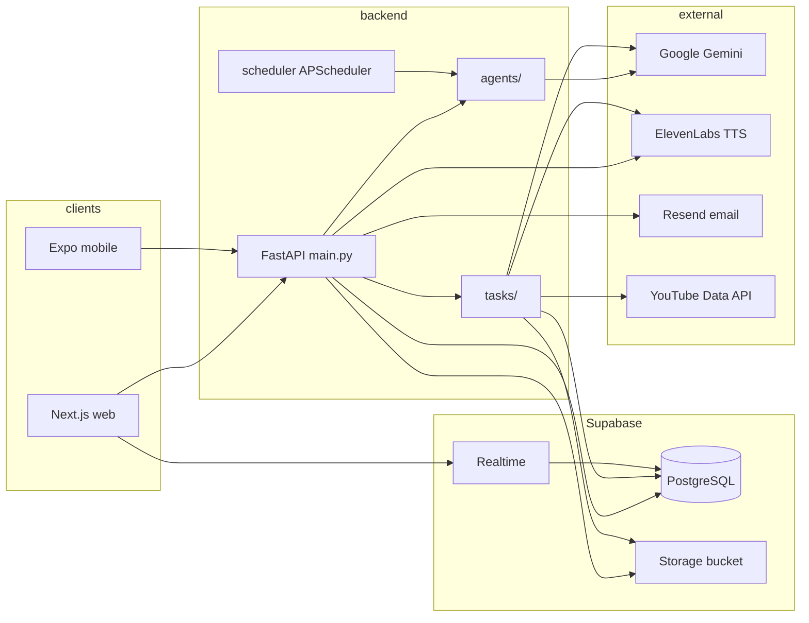

# Architecture

Crambly is a **demo-oriented monorepo**: a **FastAPI** backend, a **Next.js** desktop web app, optional **Expo** mobile (see root README), and **Supabase** (Postgres + Storage + Realtime).

## Logical view

## Responsibilities

| Layer | Role |
|-------|------|
| **Next.js (`web/`)** | Library, study hub, courses, syllabus, transforms (streaming), settings, email-notification prefs. Uses TanStack Query + Supabase JS client (anon key + Realtime). Calls FastAPI via `NEXT_PUBLIC_API_URL`. **Theming**: CSS variables in `web/styles/tokens.css`; optional **light mode** toggles `html.light-mode` (see [frontend-web.md](./frontend-web.md)). |
| **FastAPI (`backend/main.py`)** | HTTP API: upload, syllabus/deadline, transforms, preferences, TTS, meme pipeline, deck kick/delete, pulse, etc. Mounts `api/routes.py` at `/api`. |
| **`backend/api/routes.py`** | Additional REST: courses, deck generate/delete, quiz burst, meme regenerate, notification preferences. |
| **`backend/agents/`** | LLM-heavy workflows: ingestion, transformation, deadline, delivery pulse, digital twin, study DNA, expressive media (meme). |
| **`backend/tasks/`** | **Study deck asset builders** (parallel thread pool): meme, audio, wordle, puzzle, YouTube. Read concepts, call external APIs, patch `study_deck`. |
| **`backend/scheduler.py`** | In-process **APScheduler** jobs: email digests + exam reminders (see [implementation-flows.md](./implementation-flows.md)). |
| **Supabase** | Source of truth for users, uploads, concepts, study deck, courses, assessments, digital twin, notification prefs. **Service role** key on backend bypasses RLS. |

## Auth / identity (demo)

There is no full auth UI in the MVP path: the backend uses a fixed **demo user UUID** from config (`CRAMBLY_DEMO_USER_ID`). The web app mirrors this via `NEXT_PUBLIC_DEMO_USER_ID` for client-side Supabase filters where needed.

## Configuration

- **Backend**: `backend/config.py` + Pydantic `Settings` reads repo-root `.env` (and `backend/.env` if present). Optional **Imgflip** credentials enable fast classic-meme captions from `expressive_media_agent`; without them, the pipeline falls back to Gemini image or local SVG.
- **Web**: `.env.local` in `web/` for Next.js public env vars (`NEXT_PUBLIC_API_URL`, Supabase anon URL/key, demo user id, etc.).

## Deployment shape (typical)

- FastAPI on a host or container, exposed with CORS `*` for local dev.
- Next.js on Vercel or similar; `NEXT_PUBLIC_API_URL` points at the API.
- Supabase project with migrations applied in order (see [database-and-storage.md](./database-and-storage.md)).
